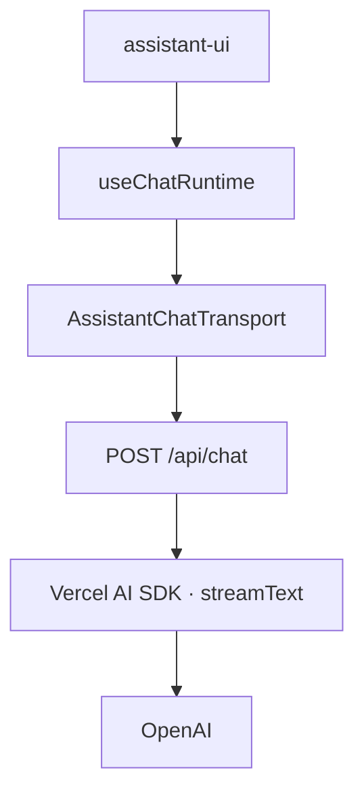
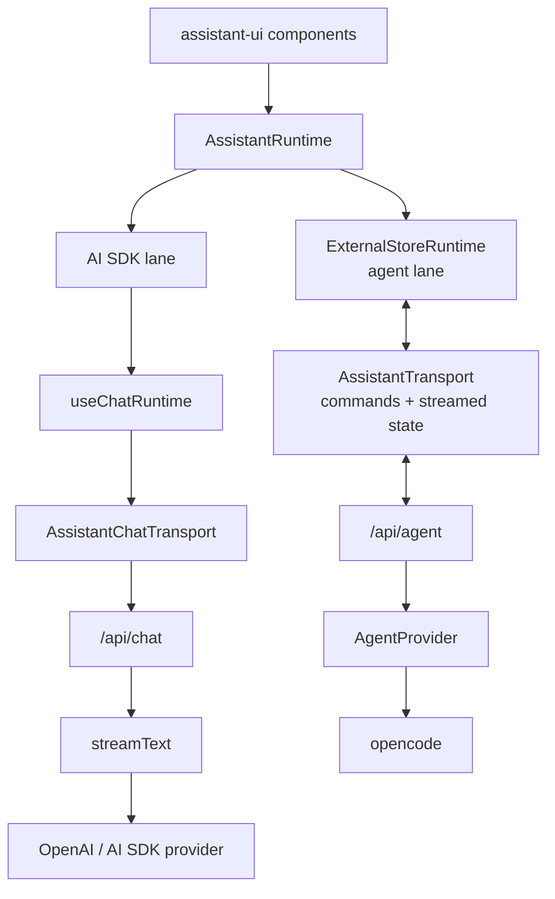
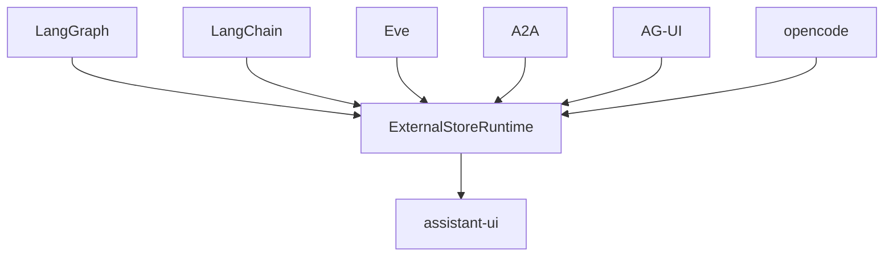
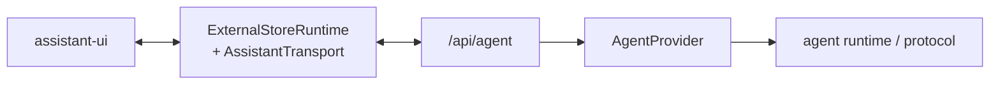
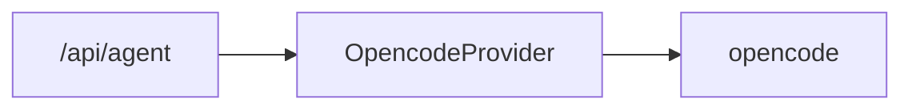
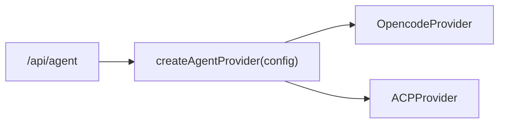
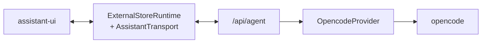
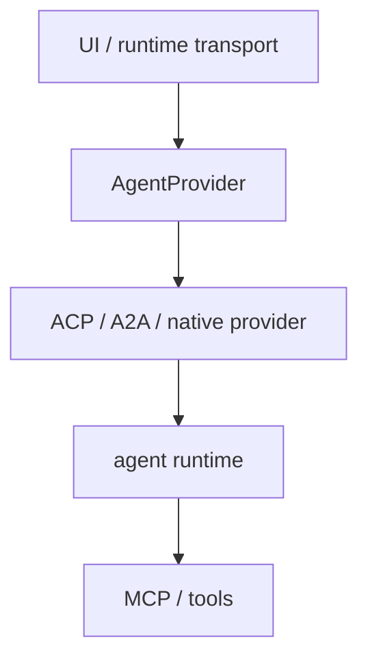

# Architecture

agentilogue aims to be a minimal chat surface for talking to agents across different runtimes and providers.

The project should stay simple: keep working integrations working, add abstraction only when a real implementation proves it is useful, and avoid turning the UI into an agent framework.

## Today

The initial assistant-ui template provides a complete working path:



This path is useful and should remain supported. It is the simplest way to use agentilogue with an AI SDK model.

## Runtime architecture

assistant-ui gives us one UI surface while allowing different runtime integrations underneath it.

The existing AI SDK path remains a first-class lane. Richer agents can use an ExternalStoreRuntime-backed lane with AssistantTransport between the browser and our backend.



The diagram is conceptual, not a strict internal call stack. The important boundaries are:

- **assistant-ui components** talk to an `AssistantRuntime`.
- **ExternalStoreRuntime** adapts externally owned conversation/agent state into assistant-ui.
- **AssistantTransport** moves commands and streamed state between that runtime and a remote backend.
- **AgentProvider** isolates a concrete agent runtime or protocol from the UI.
- **`/api/agent`** should stay thin and call the configured provider directly.

There is intentionally no `AgentService` or `AgentRegistry` in the initial design.

## Direct framework adapters

assistant-ui already demonstrates that framework-specific adapters can map directly into ExternalStoreRuntime:



These integrations are useful references for mapping framework-specific messages, state, tool calls, approvals, attachments, and actions into one UI runtime.

agentilogue does not need to force every integration through `AgentProvider`. A direct adapter can remain the simplest choice for a dedicated integration.

For agentilogue's provider-neutral backend path, the intended shape is:



Both paths should remain possible.

## Backend boundary

The backend should expose the smallest useful contract between the UI transport and a concrete agent.

A future provider contract may be as small as:

```ts
interface AgentProvider {
  readonly id: string;
  readonly capabilities: AgentCapabilities;

  run(request: AgentRequest): AsyncIterable<AgentEvent>;
  cancel?(runId: string): Promise<void>;
}
```

This is a direction, not an API commitment. opencode should determine what the real minimum contract needs to be.

The provider layer should not depend on assistant-ui types. Translation between assistant-ui/transport state and agentilogue domain types belongs at the transport boundary.

A provider may represent:

- a native SDK or API such as opencode
- a local process
- a remote/cloud agent
- a protocol adapter such as ACP or A2A
- a framework such as LangGraph when routing it through the common backend is useful

The physical location of the agent should not matter to the UI.

## Provider selection: grow only when needed

One chat session talks to one configured agent at a time. That lets the initial backend remain extremely small.

### First provider

With only opencode, the route can instantiate or resolve it directly:



No service or registry is needed.

### Second provider

When a second provider actually exists, add the smallest useful selection mechanism, likely a factory:

```ts
function createAgentProvider(config: AgentConfig): AgentProvider {
  switch (config.type) {
    case "opencode":
      return new OpencodeProvider(config);
    case "acp":
      return new AcpProvider(config);
  }
}
```



### Registry or service later

Only introduce an `AgentRegistry` if we need dynamic registration, discovery, plugins, or enough providers that a static factory becomes awkward.

Only introduce an `AgentService` if real cross-provider behavior appears, such as orchestration, shared lifecycle management, policy, retries, scheduling, or other logic that clearly does not belong in the route or provider.

Until then, both are YAGNI.

## Principles

### Keep the simple path simple

A user who only wants the AI SDK path should not need the agent-provider layer.

### Keep agent contracts UI-independent

Agent/provider contracts should use agentilogue domain types rather than assistant-ui types. Translation belongs at the runtime or transport boundary.

### Preserve native capabilities

Generic protocols are useful, but they should not force richer native integrations into a lowest-common-denominator model. A direct opencode integration, for example, may expose capabilities that a generic protocol does not.

### Prefer protocols over provider-specific glue

Where standards fit naturally, prefer reusable protocol adapters such as ACP or A2A over many nearly identical provider integrations. Native providers remain an escape hatch.

### Separate agents from tools

Agent runtimes/providers and tool protocols are different concerns. MCP and similar tool mechanisms should not become agent providers merely because both involve remote capabilities.

### Keep routing boring

Provider selection should start as direct construction and become a small factory only when provider #2 arrives. Do not add a service or registry to make the architecture look complete.

## First proof: opencode

The first deeper custom-agent integration should be opencode.

Use it to validate the smallest useful contracts for:

- text streaming
- cancellation and resume
- tool calls and results
- approvals/permissions
- attachments/files
- errors
- sessions and subagents where useful

Do not generalize the contracts before this integration creates a concrete need.

A successful first implementation should prove this path:



The goal is not merely to receive an answer. The integration should exercise enough real agent behavior that a second provider can be added without redesigning the UI or provider contract.

## References and inspiration

These projects and protocols are useful references. We should study their boundaries and lessons, not copy their complexity.

### assistant-ui

Primary reference for the frontend/runtime boundary:

- [assistant-ui](https://github.com/assistant-ui/assistant-ui)
- [ExternalStoreRuntime](https://www.assistant-ui.com/docs/runtimes/custom/external-store)
- [AssistantTransport](https://www.assistant-ui.com/docs/runtimes/custom/assistant-transport)
- [opencode runtime](https://www.assistant-ui.com/docs/runtimes/opencode/overview)
- LangGraph, LangChain, Eve, A2A, and AG-UI runtime adapters in the assistant-ui ecosystem

Study how framework-specific state, tool calls, approvals, attachments, and actions are mapped into one UI runtime without forcing the underlying framework into the UI.

### opencode

[opencode](https://github.com/anomalyco/opencode) is the first native agent integration we want to study deeply.

It should drive the first real version of the AgentProvider contract, especially around sessions, tool execution, permissions, files, streaming, and subagents.

### Archon

[Archon](https://github.com/coleam00/Archon) is useful for its provider abstraction and capability-oriented thinking.

Take inspiration from the idea of hiding concrete agent implementations behind a common provider contract, but avoid inheriting Archon-specific workflow, coding-agent, or orchestration concerns unless agentilogue actually needs them.

### Open WebUI

[Open WebUI](https://github.com/open-webui/open-webui) is useful as a mature interoperability reference.

Important lessons to keep in mind:

- prefer protocols/adapters over one-off provider glue where practical
- keep tools separate from agents
- be explicit about who owns tool execution to avoid duplicate tool-call loops
- preserve a simple model-chat path alongside richer integrations

### Omnigent and agent harnesses

[Omnigent](https://github.com/omnigent-ai/omnigent), [DeepSeek Harness](https://github.com/deepseek-ai/deepseek-harness), and similar harnesses are useful references for multi-agent/runtime interoperability.

Their breadth is inspiration, not a target. agentilogue should remain a thin chat surface rather than becoming an orchestration platform.

### Agent protocols

Protocol support should be driven by real use cases:

- [ACP](https://agentclientprotocol.com/) for client-to-coding-agent interoperability
- [A2A](https://a2a-protocol.org/) for remote agent interoperability
- [AG-UI](https://docs.ag-ui.com/) as a reference for agent-to-UI event/state exchange
- [MCP](https://modelcontextprotocol.io/) for tools and resources, not as an AgentProvider abstraction
- [Microsoft Agent Host Protocol](https://github.com/microsoft/agent-host-protocol) as a reference when multi-client or hosted agent-session coordination becomes relevant

A useful conceptual layering is:



Do not implement all of these up front. Add a protocol only when it removes real integration work or unlocks a concrete agent.

## What not to build yet

Avoid adding an AgentService, AgentRegistry, plugin framework, persistence layer, auth system, orchestration engine, or generalized event bus until the project actually needs one.

agentilogue should remain a small chat application with clean extension points, not become another agent framework.
