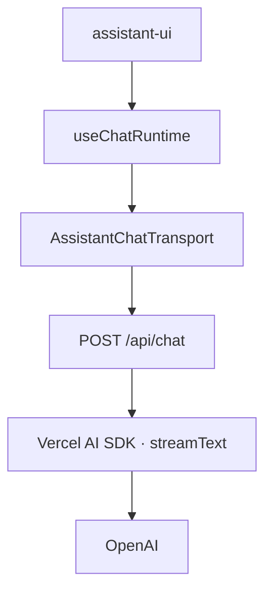
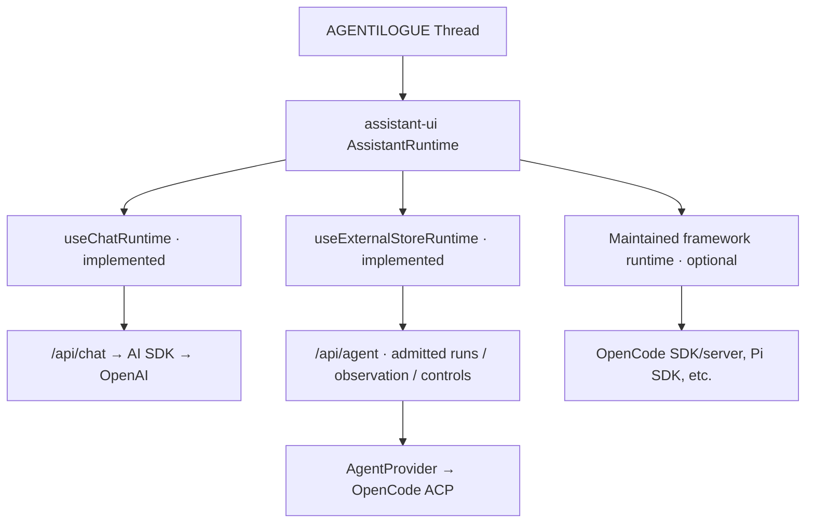
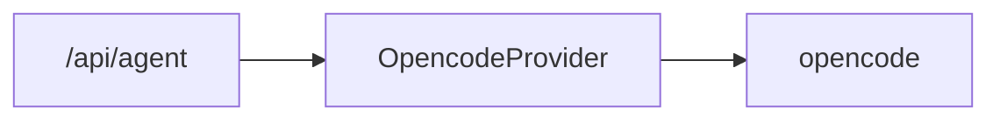

# Architecture

agentilogue aims to be a minimal chat surface for talking to agents across different runtimes and providers.

The project should stay simple: keep working integrations working, add abstraction only when a real implementation proves it is useful, and avoid turning the UI into an agent framework.

[ADR 0001](decisions/0001-agent-integration-lanes.md) defines how we select integration lanes. [CONTRACTS.md](CONTRACTS.md) governs the implemented, authoritative app-owned provider-neutral lane, not every assistant-ui runtime.

## Today

The initial assistant-ui template provides a complete working path:

This path is useful and should remain supported. It is the simplest way to use agentilogue with an AI SDK model.

## Runtime architecture

The shared frontend surface is assistant-ui's `AssistantRuntime`, provided through `AssistantRuntimeProvider`. **Runtime integrations are alternatives**, not layers every agent must pass through.

Today AI SDK and OpenCode ACP are implemented. A native OpenCode runtime was exercised only in the disposable [issue #29 spike](spikes/2026-10-opencode-integration-comparison.md); it is **not** an enabled app lane. The ACP browser adapter uses app-owned start/control requests and independently reconnectable observation encoded with maintained `assistant-stream` primitives; `AssistantTransport` is not a mandatory backend command queue.

Our `Thread` and its assistant-ui runtime interface remain stable even when the native transport, runtime hook and server API differ.

## Direct framework adapters

Where a maintained upstream runtime fits, use its public adapter without converting native messages back through our provider-neutral run model. Examples include assistant-ui's `useOpenCodeRuntime`, `usePiRuntime`, `useAgUiRuntime` and `useA2ARuntime`. Upstream integrations may use `useExternalStoreRuntime` internally; that is their implementation detail, not a requirement to add our own `AgentProvider`.

Use [ADR 0001](decisions/0001-agent-integration-lanes.md) to choose a lane. A native adapter must still meet AGENTILOGUE's deployment-specific project/session ownership, authentication, cancellation, permission and recovery requirements. The [OpenCode spike](spikes/2026-10-opencode-integration-comparison.md) found that direct SDK/server access could enumerate sessions outside the disposable project; it is therefore **not yet approved for production**.

## Backend boundary

For integrations that need AGENTILOGUE-owned process/session management, the canonical `AgentProvider` port in [`lib/agent/contracts/`](../lib/agent/contracts/) is our server-side contract. [`CONTRACTS.md`](CONTRACTS.md) defines its admission, snapshot-first observation, independently deliverable control, permission identity and truthful terminal-state rules.

Those exported types are **authoritative for the provider-neutral lane**. They do not replace assistant-ui's public `AssistantRuntime`, or a maintained native runtime's own state/transport types. Keep native SDK types isolated to their adapter; never make the UI own credentials, workspace authorization or native subprocess lifetime.

Do not add a generic `AgentService`, `AgentRegistry` or parallel event representation without a proven second implementation that needs one.

## Target agent integrations

Likely future agent targets include Pi, Codex, Claude Code and GitHub Copilot, in addition to OpenCode. Select each concrete integration using [ADR 0001](decisions/0001-agent-integration-lanes.md): first assess maintained assistant-ui adapters, then the agent's suitable native SDK/protocol and required security boundary. ACP is one option, **not** the default interface every agent must support.

Do not force a native SDK or a protocol adapter into `AgentProvider` merely to share a TypeScript port. If two backends genuinely need the same run/admission/observation/control interface, reuse the existing port; if an upstream runtime provides a better direct integration, keep it native.

## Capability model

The provider-neutral lane reports actual supported behavior through `AgentCapabilities`: continuation, reconnectability, tool updates, permissions, selection and cancellation. Capability claims require native and browser evidence, not merely an SDK method or TypeScript property.

Framework-native integrations may have richer runtime-specific capabilities, including questions, history, fork/revert and nested agent activity. Keep those with their maintained adapter; do not inflate `AgentCapabilities` into a global inventory or silently erase native functionality. Shared product decisions should follow demonstrated behavior, not superficial feature-name parity.

## Provider selection: grow only when needed

One chat session talks to one configured agent at a time. That lets the initial backend remain extremely small.

### First provider

For the existing OpenCode ACP lane, the route resolves the provider directly:

No service or registry is needed.

### Second provider using the same port

Only if a **second concrete backend** needs the existing `AgentProvider` interface should we add a small local selection function/factory. The function selects implementations of *that port*, not unrelated `AssistantRuntime` families. Different runtime families may be composed at the session/UI boundary without a new universal provider registry.

### Registry or service later

Only introduce an `AgentRegistry` if we need dynamic registration, discovery, plugins, or enough providers that a static factory becomes awkward.

Only introduce an `AgentService` if real cross-provider behavior appears, such as orchestration, shared lifecycle management, policy, retries, scheduling, or other logic that clearly does not belong in the route or provider.

Until then, both are YAGNI.

## Principles

### Keep the simple path simple

A user who only wants the AI SDK path should not need the agent-provider layer.

### Keep agent contracts UI-independent

Within the provider-neutral backend lane, app-owned contract types remain independent of assistant-ui and native SDK types. Framework-native runtimes use their upstream contracts without a translation round trip through our models.

### Preserve native capabilities

Generic protocols are useful, but they should not force richer native integrations into a lowest-common-denominator model. A direct opencode integration, for example, may expose capabilities that a generic protocol does not.

### Prefer proven, maintained integrations

Evaluate maintained assistant-ui adapters first. Use ACP, AG-UI, A2A or a native SDK at the boundary it actually solves, after testing ownership, feature and lifecycle requirements. A standard protocol is an option, not an obligatory extra layer.

### Separate agents from tools

Agent runtimes/providers and tool protocols are different concerns. MCP and similar tool mechanisms should not become agent providers merely because both involve remote capabilities.

### Keep routing boring

Construct one configured backend provider directly. Add a small factory only if another implementation uses the same backend port; do not add a universal runtime registry just because different assistant-ui adapters exist.

## First proof: OpenCode ACP

The initial deep OpenCode proof is implemented through the official ACP SDK and AGENTILOGUE's provider-neutral lane. It exercises streaming, native tool updates, permissions, cancellation, session identity and truthful unknown outcomes. See [the provider contracts](CONTRACTS.md) for its precise invariants.

The subsequent [issue #29 comparison](spikes/2026-10-opencode-integration-comparison.md) demonstrated assistant-ui's native OpenCode adapter with significantly less app-owned code but identified a cross-project session-list boundary and version mismatch. We keep ACP as the app's OpenCode path until a native lane proves equivalent project isolation and lifecycle behavior; this is not a permanent preference for ACP.

## References and inspiration

These projects and protocols are useful references. We should study their boundaries and lessons, not copy their complexity.

### assistant-ui

Primary reference for the frontend/runtime boundary:

- [assistant-ui](https://github.com/assistant-ui/assistant-ui)
- [ExternalStoreRuntime](https://www.assistant-ui.com/docs/runtimes/custom/external-store)
- [AssistantTransport](https://www.assistant-ui.com/docs/runtimes/custom/assistant-transport)
- [opencode runtime](https://www.assistant-ui.com/docs/runtimes/opencode/overview)
- LangGraph, LangChain, Eve, A2A, and AG-UI runtime adapters in the assistant-ui ecosystem

Study how framework-specific state, tool calls, approvals, attachments, and actions are mapped into one UI runtime without forcing the underlying framework into the UI.

### opencode

[opencode](https://github.com/anomalyco/opencode) is the first implemented native-agent integration and the subject of the [OpenCode native-versus-ACP spike](spikes/2026-10-opencode-integration-comparison.md). ACP is implemented today; the upstream OpenCode SDK/server runtime is a tested research alternative, not a production lane.

### Archon

[Archon](https://github.com/coleam00/Archon) is useful for its provider abstraction and capability-oriented thinking.

Take inspiration from the idea of hiding concrete agent implementations behind a common provider contract and from Archon's capability map across Claude, Codex, Copilot, Pi, and opencode. Avoid inheriting Archon-specific workflow, coding-agent, or orchestration concerns unless agentilogue actually needs them.

### Open WebUI

[Open WebUI](https://github.com/open-webui/open-webui) is useful as a mature interoperability reference.

Important lessons to keep in mind:

- prefer protocols/adapters over one-off provider glue where practical
- keep tools separate from agents
- be explicit about who owns tool execution to avoid duplicate tool-call loops
- preserve a simple model-chat path alongside richer integrations

### Omnigent and agent harnesses

[Omnigent](https://github.com/omnigent-ai/omnigent), [DeepSeek Harness](https://github.com/deepseek-ai/deepseek-harness), and similar harnesses are useful references for multi-agent/runtime interoperability.

Their breadth is inspiration, not a target. agentilogue should remain a thin chat surface rather than becoming an orchestration platform.

### Agent protocols

Protocol support follows real use cases and the boundary they serve:

- [ACP](https://agentclientprotocol.com/) for client-to-coding-agent interoperability and server-owned local agent lifecycles
- [A2A](https://a2a-protocol.org/) for remote agent tasks/artifacts
- [AG-UI](https://docs.ag-ui.com/) for agent-to-UI event/state exchange
- [MCP](https://modelcontextprotocol.io/) for tools/resources, **not** an agent provider
- [Microsoft Agent Host Protocol](https://github.com/microsoft/agent-host-protocol) as a reference for hosted coordination

These may be alternatives or complementary boundaries. Do not build a universal protocol conversion stack or require that all native integrations traverse `AgentProvider`.

## What not to build yet

Avoid adding an AgentService, AgentRegistry, plugin framework, persistence layer, auth system, orchestration engine, or generalized event bus until the project actually needs one.

agentilogue should remain a small chat application with clean extension points, not become another agent framework.
